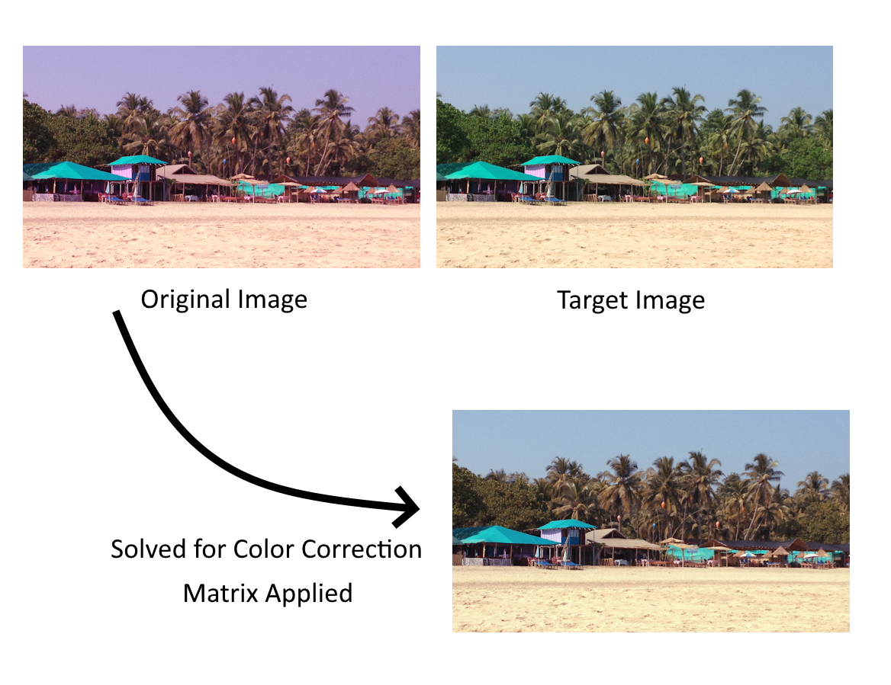

# Color Correction Matrix Solver

A C++ application that computes and applies 3x3 color correction matrices to transform one image's color palette to match another image's color characteristics. This tool uses mathematical optimization to find the optimal linear transformation matrix between two images.

## Overview

The Color Correction Matrix Solver uses the Ceres Solver optimization library to find a 3x3 color correction matrix that best transforms colors from a source image to match a target image. The solver minimizes the difference between the transformed source colors and the target colors across all pixels.

## Key Features

- **Automatic Color Correction**: Computes optimal 3x3 transformation matrices
- **High-Quality Optimization**: Uses Google's Ceres Solver for robust mathematical optimization
- **Flexible Output**: Can display the matrix or apply it to generate corrected images
- **Image Format Support**: Handles common image formats through extensible image handler
- **Command-Line Interface**: Simple and intuitive usage

## Dependencies

- **C++17** compatible compiler
- **CMake** 3.15 or higher
- **Ceres Solver** - For non-linear optimization
- **Eigen3** - For linear algebra operations (included with Ceres)

## Building the Project

### Prerequisites

1. Install Ceres Solver:
```
   # On Ubuntu/Debian
   sudo apt-get install libceres-dev
   
   # On macOS with Homebrew
   brew install ceres-solver
   
   # On Windows, download pre-built binaries or build from source
```

### Build Instructions

```
mkdir build
cd build
cmake ..
cmake --build . --config Release
```

## Usage

The application supports two modes of operation:

### 1. Matrix Calculation Only
```
./ColorCorrectionMatrixSolver <start_image> <target_image>
```

This will:
- Load both images
- Calculate the optimal color correction matrix
- Display the 3x3 transformation matrix
- **Not** generate any output image

### 2. Matrix Calculation and Application
```
./ColorCorrectionMatrixSolver <start_image> <target_image> <output_image>
```

This will:
- Load both images
- Calculate the optimal color correction matrix
- Apply the matrix to the start image
- Save the color-corrected result to the specified output path

### Example
```
# Calculate and display matrix only
./ColorCorrectionMatrixSolver images/photo_indoor.jpg images/photo_outdoor.jpg

# Calculate matrix and generate corrected image
./ColorCorrectionMatrixSolver images/photo_indoor.jpg images/photo_outdoor.jpg corrected_output.jpg
```

## How It Works

### Mathematical Approach

The solver finds a 3x3 matrix **M** that best satisfies:
```
M × [R_source, G_source, B_source]ᵀ ≈ [R_target, G_target, B_target]ᵀ
```

For each pixel in the images, the algorithm:
1. Normalizes RGB values to [0,1] range
2. Creates cost functions comparing transformed source colors to target colors
3. Uses non-linear optimization to minimize the total color difference
4. Outputs the optimal transformation matrix

### Color Correction Process

1. **Image Validation**: Ensures both images have identical dimensions and are RGB format
2. **Pixel-wise Comparison**: Compares every corresponding pixel between source and target
3. **Matrix Optimization**: Uses Ceres Solver to find the optimal linear transformation
4. **Color Clamping**: Ensures output colors remain in valid [0,255] range

## Example Results

### Input Images
- **Start Image**: Original image with color characteristics to be corrected
- **Target Image**: Reference image with desired color characteristics

### Output
- **Color Correction Matrix**: 3x3 transformation matrix
- **Corrected Image** (optional): Start image transformed to match target colors



## Technical Details

### Project Structure
```
src/
├── main.cpp                              # Application entry point
├── color_correction_application.hpp/.cpp # Main application workflow
├── color_correction_matrix_solver.hpp/.cpp # Core matrix solving logic
├── image_file_handler.hpp/.cpp           # Image I/O operations
└── image_data.hpp                        # Image data structure
```

### Key Classes

- **`ColorCorrectionApplication`**: Orchestrates the complete workflow
- **`ColorCorrectionMatrixSolver`**: Implements the optimization algorithm
- **`ImageFileHandler`**: Handles image loading and saving
- **`ColorCorrectionMatrix`**: Represents the 3x3 transformation matrix

## Limitations

- Both input images must have identical dimensions
- Only supports RGB (3-channel) images
- Linear transformation may not capture complex color relationships
- Performance scales with image size (pixel-by-pixel optimization)